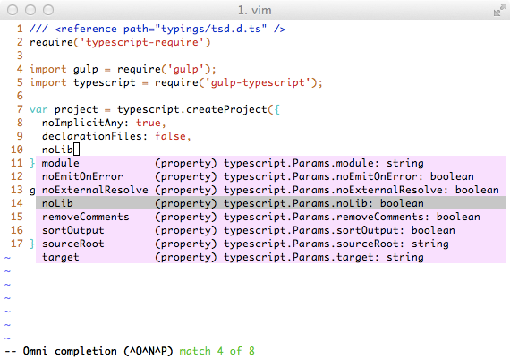

# Tsuquyomi

Tsuquyomi is a Vim plugin for TypeScript.

## Features

Tsuquyomi works as a client for **TSServer**(which is an editor service bundled into TypeScript).
So, installing Tsuquyomi, your vim gets the following features provided by TSServer:

+ Completion (omni-completion)
+ Navigate to the location where a symbol is defined.
+ Show location(s) where a symbol is referenced.
+ Display a list of syntax and seamantics errors to Vim quickfix window.
+ and so on,,,



## How to install
Tsuquyomi requires the following:

+ [Vim](http://www.vim.org/) (v7.4.0 or later)
+ [Shougo/vimproc.vim](https://github.com/Shougo/vimproc.vim)
+ [Node.js](https://nodejs.org/) & [TypeScript](https://github.com/Microsoft/TypeScript) (**v1.5.0 or later**)

If you use [NeoBundle](https://github.com/Shougo/neobundle.vim) for Vim plugin management, append the following to your `.vimrc`:

```vim
NeoBundle 'Shougo/vimproc.vim', {
\ 'build' : {
\     'windows' : 'tools\\update-dll-mingw',
\     'cygwin' : 'make -f make_cygwin.mak',
\     'mac' : 'make -f make_mac.mak',
\     'linux' : 'make',
\     'unix' : 'gmake',
\    },
\ }

NeoBundle 'Quramy/tsuquyomi'
```

And exec `:NeoBundleInstall`.

(About vimproc installation, please see [the original install guide](https://github.com/Shougo/vimproc.vim#install).)

### Install TypeScript

```bash
npm -g install typescript
```

## Usage

### Completion
Tsuquyomi supports Omni-Completion.

By the default, type `<C-x> <C-o>` in insert mode, Tsuquyomi shows completions.

### Nav to definition
Type `<C-]>` in normal mode or visual mode, Tsuquyomi navigates to the location where the symbol under the cursor is defined.

Alternatively, call the Ex comand `:TququyomiDefinition`.

And type `<C-t>` , Tsuquyomi moves the cursor to the location where the last `<C-]>` was typed.

### Show references
Type `<C-^>` in normal mode or visual mode, Tsuquyomi shows a list of location where the symbol under the cursor is referenced.

Alternatively, call the Ex comand `:TsuquyomiReferences`.

### Show quickfix
When a buffer is saved, Tsuquyomi checks syntax and semantics.
And if it contains errors, Tsuquyomi show them to Vim quickfix window.

### Configure compile options
Make [tsconfig.json](https://github.com/Microsoft/TypeScript/wiki/tsconfig.json).

For example:

```json
{
  "compilerOptions": {
    "noImplicitAny": true,
    "target": "es5",
    "module": "commonjs"
  }
}
```

When you change tsconfig.json after opening `*.ts` files, you should exec `:TsuquyomiReloadProject` command.
So, the changes of tsconfig.json are reflected in the TSServer.

### Rename symbols

Using the command `:TsuquyomiRenameSymbol`, you can rename the identifiler under the cursor to a new name.

This feature does not have the default key mapping.
If you need, configure your `.vimrc` . For example: 

```vim
autocmd FileType typescript nmap <buffer> <Leader>e <Plug>(TsuquyomiRenameSymbol)
```

### Show tooltip(balloon)
Tsuquyomi can display tooltip window about symbol under the mouse cursor.
If you want to use this feature, configure `.vimrc` as follows:

```vim
set ballooneval
autocmd FileType typescript setlocal ballonexpr=tsuquyomi#ballonexpr()
```


### Show outline(an extension of unite-outline)
This feature requires Vim plugins:

* [unite](https://github.com/Shougo/unite.vim)
* [unite-outline](https://github.com/Shougo/unite-outline).

If you have installed these plugins, calling the following Ex command, the outline of the current buffer is displayed.

```vim
:Unite outline
```

### More details
If you want more details, please see [doc](doc/tsuquyomi.txt).

## Future works

+ syntax highright
+ etc ...

## License
MIT
